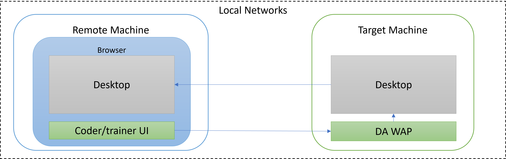

## **Concept**

- The DA module uses a remote training mechanism to avoid UI conflicts on the automated target system.
  - This remote training mechanism will only be used when training or updating skills, and the DA skills can be executed directly on the target computer independently after training.
- The DA module uses a computer vision-based approach to positioning and operating the desktop system.
  - So any UI used for targeting in the Target Machine cannot be covered by other UI.

## **Requirement**

- Window10 64bit
- Microsoft Visual C++ Redistributable
  - https://learn.microsoft.com/en-US/cpp/windows/latest-supported-vc-redist?view=msvc-170

## **Restriction**

- The DA skill takes up the mouse and keyboard when it works.
- The user must ensure that the state of the input method (IME) is the same as during training.

## **Reference**

official document link:

- https://docs.emily.tips/da
