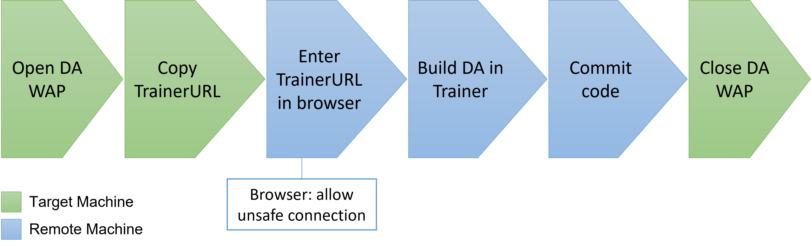

## **Open DA Wap at Target Machine**

- DA Wap will start a sever with a URL like above to let other machine can training this machine through the browser with this URL.

## **Enter DA Trainer mode at Remote Machine**

- Because URL is HTTP protocol, so we need to disable web protection by ourself.

- The web page of the remote machine presents the "snapshot" of the target machine desktop, not the live screen.
- So the training will be done in the remote machine through the browser.
  - So the remote machine should not need to install Emily, it only needs to have a browser to train.
- When the training is finished, click commit on the code page of the remote machine to transfer the training code to the DA WAP of the target machine.
  - So the target machine can use the delivered training code for DA from now on, and no remote machine is needed.
